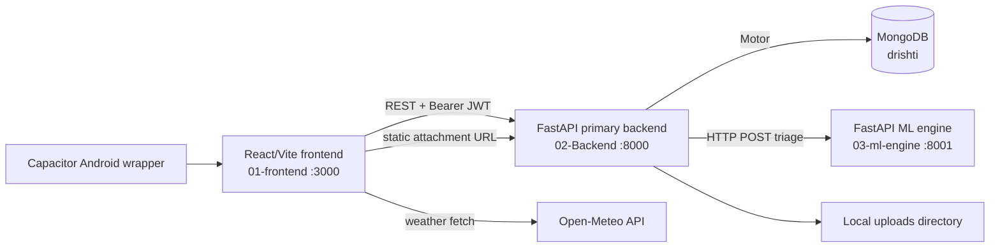
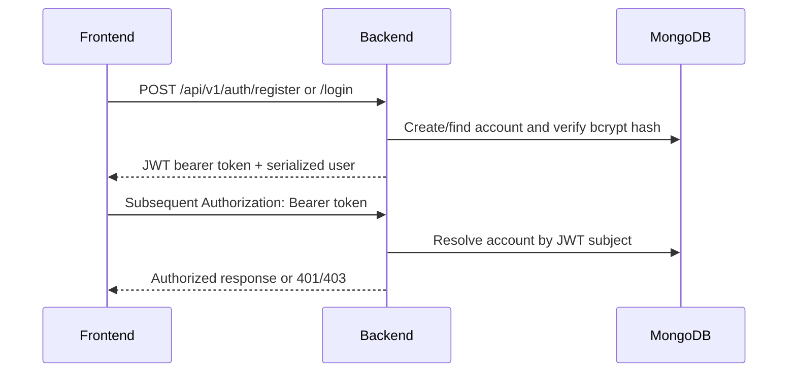
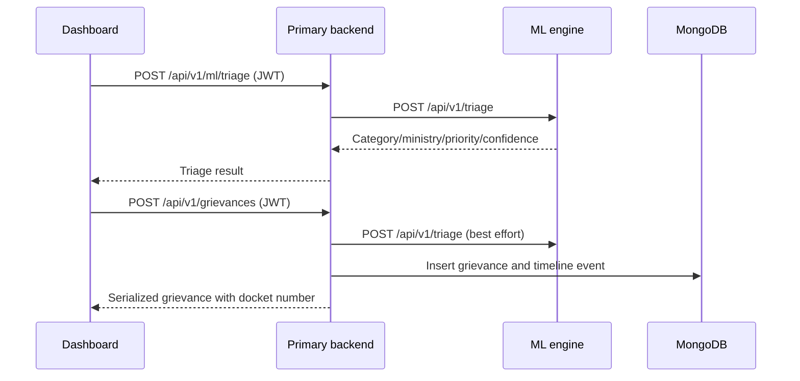
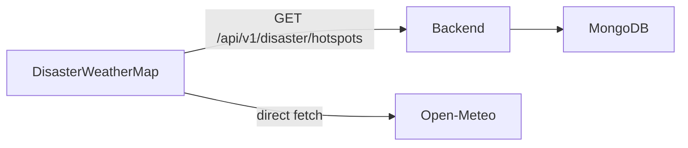

# DRISHTI Architecture

**Last Updated:** 2026-08-19  
**Related:** [PRD](PRD.md) · [TDR](TDR.md) · [Contracts](CONTRACTS.md)

## High-level architecture

## Components

| Component | Responsibility | Status |
|---|---|---|
| `01-frontend` | Browser UI, hash navigation, API client, map and weather UI | IMPLEMENTED |
| `02-Backend/main.py` | Primary FastAPI application, CORS, route registration, static uploads, Mongo lifecycle | IMPLEMENTED |
| MongoDB | Users, officers, grievances, timeline events, hotspots | IMPLEMENTED |
| `03-ml-engine` | Local triage classification service | IMPLEMENTED |
| `03-ml-engine/vision_service` | Separate YOLO/WebSocket/scene-memory prototype; model in `03-ml-engine/models/` | NOT YET IMPLEMENTED as part of the primary frontend/backend architecture |
| `02-Backend/app/main.py` and adjacent legacy folders | Stale alternate MongoDB/auth stub | NOT YET IMPLEMENTED as part of the primary architecture; do not use as entrypoint |
| Open-Meteo | Weather source queried by frontend | IMPLEMENTED client integration |

## Core data flows

### Authentication

### Triage and grievance submission

If the ML service is unavailable, direct triage returns 503; grievance creation still inserts the report with `aiTriaged: false`.

### Disaster and weather views

## Runtime relationships

- Frontend default API base URL: `http://localhost:8000`.
- Backend default ML URL: `http://localhost:8001`.
- Backend default MongoDB URI: `mongodb://localhost:27017`.
- Browser development origin is port 3000; backend additionally includes port 5173 in default CORS origins.
- The backend mounts local filesystem uploads at `/uploads`; URLs are built by the frontend using its configured API base URL.

## Important boundaries

- The active ML integration is the deterministic triage API on port 8001. The preserved vision service is a separate optional process on port 8002 and does not load during triage startup.
- The YOLO model and vision code are consolidated under `03-ml-engine`; they are not connected to the frontend or `02-Backend`. Do not merge the vision service into the primary path without an explicit design decision.
- `02-Backend/main.py` is the only evidenced primary backend entrypoint. The nested `02-Backend/app/main.py` is an alternate stale stub, not a second production service.
- Weather is not proxied by the backend; browser availability and Open-Meteo availability affect that UI directly.
