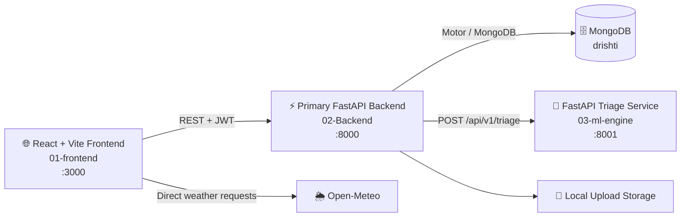

# 🌐 DRISHTI

**AI-assisted civic grievance intelligence and disaster-risk awareness platform.**

DRISHTI is an R&D prototype designed to improve how civic grievances are **submitted, understood, tracked, and connected with disaster-risk information**.

The platform combines a **React web application**, **FastAPI backend**, **MongoDB**, and a lightweight **AI-assisted grievance triage service**. It also preserves an independent computer-vision prototype for future exploration.

> 🚧 **Project Status:** Active R&D prototype — **not production-ready**.

---

## 📑 Table of Contents

* [🌐 Overview](#-overview)
* [🚀 Core Capabilities](#-core-capabilities)
* [🏗️ System Architecture](#️-system-architecture)
* [📂 Repository Structure](#-repository-structure)
* [🧰 Technology Stack](#-technology-stack)
* [⚙️ Prerequisites](#️-prerequisites)
* [📦 Installation](#-installation)
* [▶️ Running DRISHTI](#️-running-drishti)
* [👁️ Optional Vision Prototype](#️-optional-vision-prototype)
* [🔌 API Reference](#-api-reference)
* [🤖 AI / ML Architecture](#-ai--ml-architecture)
* [🧪 Development & Verification](#-development--verification)
* [📊 Project Status](#-project-status)
* [⚠️ Known Limitations](#️-known-limitations)
* [🔐 Security Considerations](#-security-considerations)
* [🤝 Contribution Guidelines](#-contribution-guidelines)
* [📜 License](#-license)

---

# 🌐 Overview

DRISHTI is an **R&D prototype for AI-assisted civic grievance intake and disaster-risk awareness**.

The primary application allows citizens to:

* 👤 Create an account and authenticate securely.
* 📝 Submit civic grievances.
* 📎 Attach supporting files.
* 📍 Track submitted grievances.
* 🔎 Look up grievances using a registration/docket number.
* 🤖 Receive AI-assisted categorization and priority suggestions.
* 🗺️ View seeded disaster-risk hotspots.
* 🌦️ View weather information fetched directly from Open-Meteo.

The backend provides the core application API, persistence, authentication, file handling, disaster-hotspot data, and communication with the ML service.

The repository also contains a separate **computer-vision prototype** based on YOLO, WebSockets, spatial analysis, and scene memory. This component is intentionally isolated from the primary grievance workflow.

---

# 🚀 Core Capabilities

## 🏛️ Civic Grievance Management

* 👤 Citizen registration and login
* 🛡️ Officer authentication
* 🔑 JWT bearer authentication
* 🗄️ MongoDB-backed grievance storage
* 📝 Grievance creation and retrieval
* 🔄 Grievance status management
* 🕒 Timeline events for grievance lifecycle changes
* 🔎 Public grievance lookup using registration/docket numbers
* 📎 Local attachment uploads

## 🤖 AI-Assisted Triage

The active ML engine analyzes:

* 📝 Grievance description
* 📄 Optional attachment filename

It returns:

* 🏷️ Category
* 🏛️ Ministry
* 📂 Subcategory
* 🚨 Priority
* 📈 Confidence
* 🔍 Matching signals
* ⚙️ Triage-engine identifier

> 💡 The current implementation is a **transparent deterministic keyword-rule baseline**, not a trained machine-learning classifier.

## 🌪️ Disaster Awareness

The system currently supports:

* 📍 Seeded disaster hotspots
* 🗺️ Backend hotspot APIs
* 🌦️ Browser-side weather information
* 🧭 Map-based disaster-risk visualization

Weather requests are **not proxied through the backend**.

## 📱 Mobile Support

The frontend includes a **Capacitor Android wrapper**, allowing the web application to be synchronized into an Android project.

## 👁️ Experimental Computer Vision

The repository also preserves an independent vision prototype containing:

* 🎯 YOLO-based object detection
* 🔌 WebSocket video streaming
* 📐 Spatial analysis
* 🧠 Sentence Transformer embeddings
* 💾 In-memory scene memory
* 🎙️ Optional webcam and speech client

> ⚠️ The vision prototype is **not part of the primary DRISHTI application flow**.

---

# 🏗️ System Architecture



### 🔄 Primary Request Flow

```text
👤 Citizen
   │
   ▼
🌐 React Frontend
   │
   │ REST + JWT
   ▼
⚡ FastAPI Backend
   │
   ├──────────────► 🗄️ MongoDB
   │
   ├──────────────► 📁 Local Upload Storage
   │
   └──────────────► 🤖 ML Triage Engine
                         │
                         ▼
                    📊 Triage Result
```

The frontend communicates with the primary backend for application data.

The backend communicates with the ML engine for grievance triage.

If the ML engine is unavailable:

```text
POST /api/v1/ml/triage
        │
        ▼
      ❌ 503
```

However, grievance creation does **not** depend on ML availability. A grievance can still be created with:

```json
{
  "aiTriaged": false
}
```

The optional vision service runs independently on port `8002` and currently has no frontend route or primary-backend proxy.

---

# 📂 Repository Structure

```text
.
├── 01-frontend/
│   ├── src/
│   │   ├── api/                  # 🔌 Backend API client modules
│   │   ├── components/           # 🎨 UI components and workflows
│   │   ├── assets/               # 🖼️ Static assets
│   │   ├── i18n/                 # 🌍 Translations
│   │   ├── types/                # 🧩 TypeScript types
│   │   └── utils/                # 🛠️ Frontend utilities
│   ├── android/                  # 📱 Capacitor Android wrapper
│   ├── package.json
│   └── .env.example
│
├── 02-Backend/
│   ├── main.py                   # ⚡ Active FastAPI entry point
│   ├── app/
│   │   ├── api/routes/            # 🔌 Active API routes
│   │   ├── db/                    # 🗄️ MongoDB models and indexes
│   │   ├── services/ml.py         # 🤖 ML service client
│   │   ├── config.py              # ⚙️ Environment configuration
│   │   └── database.py            # 🗄️ MongoDB lifecycle and seeding
│   ├── uploads/                  # 📁 Local uploaded files
│   ├── requirements.txt
│   └── .env.example
│
├── 03-ml-engine/
│   ├── main.py                   # 🤖 Active triage API
│   ├── triage.py                 # 🧠 Keyword-rule triage engine
│   ├── models/
│   │   └── yolov8n.pt             # 🎯 YOLO model
│   ├── vision_service/            # 👁️ Optional vision prototype
│   │   ├── api/v1/endpoints/
│   │   ├── services/
│   │   ├── core/
│   │   ├── db/
│   │   └── models/
│   ├── clients/
│   │   └── client_stream.py       # 🎥 Optional webcam/speech client
│   ├── requirements.txt
│   ├── requirements-vision.txt
│   ├── requirements-vision-client.txt
│   └── .env.example
│
├── 04-database/
│   └── ...                        # 🗄️ Standalone PyMongo helper
│
├── ARCHITECTURE.md                # 🏗️ Architecture and data flows
├── CONTRACTS.md                   # 🔌 API and integration contracts
├── PROGRESS.md                    # 📊 Development and validation status
├── PRD.md                         # 📋 Product requirements
├── TDR.md                         # 🧠 Technical design decisions
├── RESEARCH.md                    # 🔬 Research and project context
└── README.md
```

> ⚠️ **Important:** `02-Backend/main.py` is the active backend entry point. Older nested backend files are retained for reference and are **not part of the primary runtime**.

---

# 🧰 Technology Stack

| Layer                | Technologies                                |
| -------------------- | ------------------------------------------- |
| 🌐 Frontend          | React 19, TypeScript, Vite 6                |
| 🎨 UI                | Tailwind CSS 4, Lucide React, Motion        |
| 🗺️ Maps             | Leaflet                                     |
| 📱 Mobile            | Capacitor 8, Android                        |
| ⚡ Backend            | FastAPI, Uvicorn, Pydantic                  |
| 🗄️ Database         | MongoDB                                     |
| 🔌 Database Driver   | Motor / PyMongo                             |
| 🔐 Authentication    | JWT, PyJWT, bcrypt                          |
| ⚙️ Configuration     | `python-dotenv`                             |
| 🤖 Active ML         | FastAPI + deterministic keyword-rule engine |
| 👁️ Vision Prototype | Ultralytics YOLO, OpenCV                    |
| 🧠 Scene Memory      | Sentence Transformers                       |
| 🔌 Realtime Vision   | WebSockets                                  |
| 🛠️ Tooling          | TypeScript, Vite, Python `compileall`       |

---

# ⚙️ Prerequisites

Before running DRISHTI locally, install:

* 🟢 Node.js
* 📦 npm
* 🐍 Python 3
* 🧪 `venv`
* 📦 `pip`
* 🗄️ MongoDB

The primary backend expects:

```text
mongodb://localhost:27017
```

with the default database:

```text
drishti
```

The optional vision client additionally requires:

* 📷 Camera
* 🎙️ Audio input/output devices
* 💻 Platform support for OpenCV and audio dependencies

---

# 📦 Installation

## 🌐 1. Frontend

```bash
cd 01-frontend

cp .env.example .env

npm ci
```

### Frontend Environment Variables

| Variable            | Default                 | Purpose               |
| ------------------- | ----------------------- | --------------------- |
| `VITE_API_BASE_URL` | `http://localhost:8000` | ⚡ Primary backend URL |

---

## ⚡ 2. Primary Backend

```bash
cd 02-Backend

python3 -m venv .venv

source .venv/bin/activate

pip install -r requirements.txt

cp .env.example .env
```

### Backend Environment Variables

| Variable                    | Default                     | Purpose                       |
| --------------------------- | --------------------------- | ----------------------------- |
| `PROJECT_NAME`              | `Drishti API`               | FastAPI application title     |
| `API_V1_STR`                | `/api/v1`                   | API prefix                    |
| `MONGODB_URI`               | `mongodb://localhost:27017` | MongoDB connection URI        |
| `MONGODB_DB`                | `drishti`                   | Database name                 |
| `JWT_SECRET`                | Development placeholder     | 🔐 JWT signing secret         |
| `JWT_EXPIRE_MINUTES`        | `60`                        | ⏱️ JWT lifetime               |
| `ENVIRONMENT`               | `development`               | Runtime environment           |
| `CORS_ORIGINS`              | `http://localhost:5173`     | 🌐 Additional allowed origins |
| `ML_ENGINE_URL`             | `http://localhost:8001`     | 🤖 Triage service URL         |
| `ML_ENGINE_TIMEOUT_SECONDS` | `3`                         | ⏱️ ML service timeout         |

### 🚀 Startup Behavior

On successful startup, the backend:

1. 🔌 Connects to MongoDB.
2. ❤️ Verifies database connectivity.
3. 🗂️ Creates required indexes.
4. 👤 Seeds development/demo officer data.
5. 📍 Seeds disaster hotspots if the hotspot collection is empty.

> ⚠️ Demo officer accounts and seed data are intended for development only.

---

## 🤖 3. ML Engine

```bash
cd 03-ml-engine

python3 -m venv .venv

source .venv/bin/activate

pip install -r requirements.txt

cp .env.example .env
```

The active triage engine does not require environment variables for local execution.

---

# ▶️ Running DRISHTI

Start MongoDB first.

Then run the three primary services in separate terminals.

### 🤖 Terminal 1 — ML Engine

```bash
cd 03-ml-engine

source .venv/bin/activate

python -m uvicorn main:app \
  --reload \
  --host 127.0.0.1 \
  --port 8001
```

### ⚡ Terminal 2 — Backend

```bash
cd 02-Backend

source .venv/bin/activate

python -m uvicorn main:app \
  --reload \
  --host 127.0.0.1 \
  --port 8000
```

### 🌐 Terminal 3 — Frontend

```bash
cd 01-frontend

npm run dev
```

### 🔗 Local Services

| Service      | URL                            |
| ------------ | ------------------------------ |
| 🌐 Frontend  | `http://localhost:3000`        |
| ⚡ Backend    | `http://localhost:8000`        |
| 📚 API Docs  | `http://localhost:8000/docs`   |
| 🤖 ML Engine | `http://localhost:8001`        |
| ❤️ ML Health | `http://localhost:8001/health` |

---

# 👁️ Optional Vision Prototype

The computer-vision system is independent from the primary DRISHTI architecture.

It runs on port `8002`.

```bash
cd 03-ml-engine

source .venv/bin/activate

pip install -r requirements-vision.txt

python -m uvicorn vision_service.main:app \
  --reload \
  --host 127.0.0.1 \
  --port 8002
```

### Vision Capabilities

* 🎯 YOLO object detection
* 📡 WebSocket JPEG streaming
* 📐 Spatial analysis
* 🧠 Scene-memory embeddings
* 🔎 Semantic scene search

The vision prototype currently has:

* ❌ No frontend integration
* ❌ No primary-backend proxy
* ❌ No MongoDB integration
* ❌ No production persistence layer

### 🎥 Optional Webcam Client

```bash
cd 03-ml-engine

pip install -r requirements-vision-client.txt

python clients/client_stream.py
```

---

# 🔌 API Reference

All primary backend endpoints use:

```text
/api/v1
```

Authenticated endpoints require:

```http
Authorization: Bearer <JWT>
```

## 🔐 Authentication

| Method | Endpoint              | Auth   | Description                |
| ------ | --------------------- | ------ | -------------------------- |
| `GET`  | `/health`             | ❌      | Backend and MongoDB health |
| `GET`  | `/status`             | ❌      | Backend status             |
| `POST` | `/auth/register`      | ❌      | 👤 Register citizen        |
| `POST` | `/auth/login`         | ❌      | 🔐 Citizen login           |
| `POST` | `/auth/officer/login` | ❌      | 🛡️ Officer login          |
| `GET`  | `/auth/me`            | 🔑 JWT | Current user               |

## 📝 Grievances

| Method  | Endpoint                                     | Auth                  | Description                     |
| ------- | -------------------------------------------- | --------------------- | ------------------------------- |
| `GET`   | `/grievances`                                | 🔑 JWT                | Retrieve accessible grievances  |
| `POST`  | `/grievances`                                | 👤 Citizen JWT        | Create grievance                |
| `GET`   | `/grievances/lookup?registration_number=...` | ❌                     | 🔎 Public grievance lookup      |
| `GET`   | `/grievances/{id}`                           | 🔑 JWT                | Retrieve grievance and timeline |
| `PATCH` | `/grievances/{id}/status`                    | 🛡️ Officer/Admin JWT | 🔄 Update status                |

## 📎 Uploads

| Method | Endpoint   | Auth   | Description                  |
| ------ | ---------- | ------ | ---------------------------- |
| `POST` | `/uploads` | 🔑 JWT | Store multipart file locally |

## 🌪️ Disaster Data

| Method | Endpoint             | Auth | Description                   |
| ------ | -------------------- | ---- | ----------------------------- |
| `GET`  | `/disaster/hotspots` | ❌    | 📍 Retrieve disaster hotspots |
| `POST` | `/disaster/seed`     | ❌    | 🌱 Seed hotspot data          |

## 🤖 ML

| Method | Endpoint     | Auth   | Description                   |
| ------ | ------------ | ------ | ----------------------------- |
| `POST` | `/ml/triage` | 🔑 JWT | 🤖 Proxy request to ML engine |

---

# 🤖 AI / ML Architecture

## 🧠 Active Triage Engine

The active ML engine is intentionally lightweight and deterministic.

It analyzes grievance text against predefined keyword rules covering areas such as:

* 🌊 Flood and disaster emergencies
* 🛣️ Road damage
* 🏦 EPFO-related issues
* 🏥 Health-related complaints
* 📋 General fallback cases

The engine returns a structured triage result.

### Example Request

```http
POST /api/v1/ml/triage
```

```json
{
  "description": "Flood water is entering our street",
  "filename": "photo.jpg"
}
```

### Example Response

```json
{
  "label": "Disaster Relief / Urban Inundation & Flood Emergency",
  "ministry": "Ministry of Home Affairs / NDMA",
  "category": "Disaster Relief & Emergency Response",
  "subCategory": "Immediate Rescue Boat Deployment & Dewatering",
  "priority": "urgent",
  "confidence": 0.75,
  "signals": [
    "flood",
    "water"
  ],
  "engine": "keyword-baseline-v1"
}
```

### ⚠️ Important

The current system should **not** be described as having a trained AI/ML classification model.

It is a:

> 🧠 **Deterministic keyword-rule baseline for AI-assisted grievance triage.**

There is currently:

* ❌ No training pipeline
* ❌ No model-training dataset
* ❌ No learned classifier
* ❌ No evaluation benchmark
* ❌ No calibrated confidence model

The API contract is designed so that the baseline can later be replaced with a trained model without requiring a complete rewrite of the application.

---

# 🔄 Grievance Lifecycle

A grievance may progress through:

```text
📝 submitted
      │
      ▼
🔍 under_review
      │
      ▼
👤 assigned
      │
      ▼
⚙️ in_progress
      │
      ├──────────────► ❌ rejected
      │
      ▼
✅ resolved
```

Creating a grievance creates its initial timeline event.

Status changes create additional timeline events.

---

# 🧪 Development & Verification

## 🌐 Frontend

### TypeScript / Lint Check

```bash
npm run lint
```

### Production Build

```bash
npm run build
```

### Clean Build Artifacts

```bash
npm run clean
```

---

## ⚡ Backend

### Python Syntax Verification

```bash
python -m compileall -q .
```

### Import Active FastAPI Application

```bash
python -c "from main import app; print('OK')"
```

---

## 🤖 ML Engine

### Health Check

```bash
curl http://localhost:8001/health
```

---

## 📱 Android

Synchronize the web application with Android:

```bash
npx cap sync android
```

---

# 📊 Validation Status

Current development validation includes:

* ✅ Frontend lint/build verification
* ✅ Backend Python compilation
* ✅ Backend application import verification
* ✅ OpenAPI generation checks
* ✅ ML engine import verification
* ✅ Triage inference checks
* ✅ Authentication flow
* ✅ Grievance creation
* ✅ Grievance lookup
* ✅ Disaster-hotspot retrieval
* ✅ Frontend/backend integration
* ✅ Capacitor synchronization

Currently unavailable:

* ❌ Repository CI configuration
* ❌ Comprehensive automated API test suite
* ❌ Production deployment pipeline

The latest frontend build succeeds, although Vite reports a large-chunk warning.

---

# 📊 Project Status

DRISHTI is an **active R&D prototype**.

| Area                             | Status             |
| -------------------------------- | ------------------ |
| 🌐 React frontend                | ✅ Implemented      |
| 🔐 Authentication                | ✅ Implemented      |
| 🛡️ JWT authorization            | ✅ Implemented      |
| 📝 Grievance management          | ✅ Implemented      |
| 🕒 Grievance timeline            | ✅ Implemented      |
| 📎 Local attachments             | ✅ Implemented      |
| 🔎 Public grievance lookup       | ✅ Implemented      |
| 🌪️ Disaster hotspots            | ✅ Implemented      |
| 🌦️ Weather integration          | ✅ Implemented      |
| 🤖 Backend ↔ ML integration      | ✅ Implemented      |
| 🧠 Keyword-rule triage           | ✅ Implemented      |
| 📱 Capacitor synchronization     | ✅ Implemented      |
| 👁️ Vision prototype             | 🧪 Experimental    |
| 🧠 Trained triage model          | 🔴 Not implemented |
| 🧪 Automated API tests           | 🔴 Not implemented |
| ☁️ Production deployment         | 🔴 Not implemented |
| 🔐 Production security hardening | 🔴 Not implemented |

---

# ⚠️ Known Limitations

### 1. 🧠 Triage Is Not a Trained Model

The active triage system is a deterministic keyword-rule baseline.

Its confidence score should **not** be interpreted as the calibrated probability of a trained classifier.

### 2. 🌦️ Weather Depends on External Availability

Weather data is fetched directly by the browser from Open-Meteo.

The application therefore depends on network and external API availability.

### 3. 🖥️ Some UI Content Is Demonstrative

Certain dashboard, timeline, and workflow elements contain sample/static content rather than fully integrated backend data.

### 4. 📎 Upload Security Is Incomplete

Uploaded files currently lack a complete production-grade security pipeline.

Missing controls include:

* MIME/type validation
* Malware scanning
* File-size enforcement
* Content inspection
* Retention policy
* Secure object storage
* Access-control hardening

### 5. 🌱 Public Disaster Seeding

`POST /api/v1/disaster/seed` is currently publicly accessible and requires authorization review before production deployment.

### 6. 🔎 Public Grievance Lookup

The public docket lookup mechanism requires additional privacy and authorization decisions before production use.

### 7. 📱 Android Build Verification

Capacitor synchronization succeeds, but Android debug APK assembly has previously been blocked by a Gradle `8.14.3` download timeout.

### 8. 👁️ Vision Prototype

The vision service remains an experimental subsystem and should not be interpreted as part of the active civic-grievance architecture.

---

# 🧩 Features Shown in UI but Not Fully Integrated

Some concepts appear in the interface or project design but do not currently have matching primary-backend integrations.

These include:

* 🔢 OTP authentication
* 🪪 Parichay SSO
* 📱 SMS notifications/reminders
* ⛓️ CPGRAMS ledger activity
* 👮 Automatic officer assignment
* 🧠 Production-grade AI classification
* 🌪️ Production disaster prediction
* 👁️ Integrated computer vision

These should be treated as **planned or conceptual functionality**, not currently implemented capabilities.

---

# 🔐 Security Considerations

DRISHTI is a prototype and should **not be deployed as-is for handling sensitive civic data**.

Before production deployment:

* 🔑 Replace the development `JWT_SECRET`.
* 🔐 Use secure secret management.
* 🚫 Never commit `.env` files.
* 🚫 Never commit credentials or API keys.
* 📎 Enforce strict upload validation.
* 🦠 Add malware scanning.
* 📏 Add upload size limits.
* 🗑️ Define file-retention policies.
* 🔒 Restrict public administrative endpoints.
* 👤 Review public grievance lookup privacy.
* 🌐 Harden CORS configuration.
* 🚦 Add rate limiting.
* 🧪 Add comprehensive authorization tests.
* 📋 Add audit logging.
* ☁️ Use secure production storage for attachments.
* 📜 Review third-party model and dataset licenses.
* 🎯 Verify redistribution rights for `yolov8n.pt`.
* 🧠 Verify provenance and licensing of downloaded Sentence Transformer assets.

---

# 🗄️ Data & Persistence

The primary application uses MongoDB.

Default configuration:

```text
MongoDB URI: mongodb://localhost:27017
Database:    drishti
```

MongoDB stores primary application data including:

* 👤 Users
* 📝 Grievances
* 🕒 Grievance timelines
* 📍 Disaster hotspots
* 📊 Application metadata

Uploaded files are currently stored locally under:

```text
02-Backend/uploads/
```

The optional vision prototype currently relies on in-process memory for scene-memory functionality and does not participate in the primary MongoDB persistence architecture.

---

# 📚 Architecture Documentation

Additional project documentation is maintained in:

| Document          | Purpose                                |
| ----------------- | -------------------------------------- |
| `ARCHITECTURE.md` | 🏗️ System architecture and data flows |
| `CONTRACTS.md`    | 🔌 API and integration contracts       |
| `PROGRESS.md`     | 📊 Development and validation status   |
| `PRD.md`          | 📋 Product requirements                |
| `TDR.md`          | 🧠 Technical design decisions          |
| `RESEARCH.md`     | 🔬 Research and project context        |

When modifying architecture or API contracts, update the corresponding documentation.

---

# 🤝 Contribution Guidelines

When contributing to DRISHTI:

1. 🧩 Keep primary application logic separate from experimental services.
2. ⚡ Use `02-Backend/main.py` as the active backend entry point.
3. 🔌 Place primary API routes under `02-Backend/app/api/routes/`.
4. 🌐 Add frontend API communication through `01-frontend/src/api/`.
5. 🤖 Keep the active triage service separate from `vision_service/`.
6. 🔌 Update API contracts when request/response structures change.
7. 🏗️ Update architecture documentation when topology changes.
8. 📊 Update `PROGRESS.md` when implementation or validation status changes.
9. 🔐 Never commit credentials, secrets, local environments, or generated uploads.
10. 🧪 Run relevant verification commands before submitting changes.

---

# 📜 License

No license file is currently present in this repository.

Unless a license is added, **do not assume that the project is licensed for redistribution, modification, or commercial reuse** beyond rights explicitly granted by the project owners.

---

# 🚀 DRISHTI at a Glance

```text
                    🌐 DRISHTI
                        │
          ┌─────────────┴─────────────┐
          │                           │
          ▼                           ▼
   🏛️ Civic Intelligence       🌪️ Disaster Awareness
          │                           │
          ▼                           ▼
   📝 Grievance Intake         🗺️ Risk Hotspots
   🤖 AI-Assisted Triage       🌦️ Weather
   🔎 Tracking & Lookup
          │
          └─────────────┬─────────────┘
                        │
                        ▼
                 ⚡ FastAPI Backend
                        │
              ┌─────────┼─────────┐
              ▼         ▼         ▼
          🗄️ MongoDB  🤖 ML     📁 Storage
                        │
                        ▼
                 🧠 Triage Engine

              ─────────────────────

                 👁️ Experimental
                Vision Prototype
                        │
              ┌─────────┼─────────┐
              ▼         ▼         ▼
           🎯 YOLO   📡 WebSocket  🧠 Memory
```

> **DRISHTI is currently a prototype foundation for exploring how civic grievance intelligence, AI-assisted triage, and disaster-risk awareness can converge into a unified public-service platform.**
